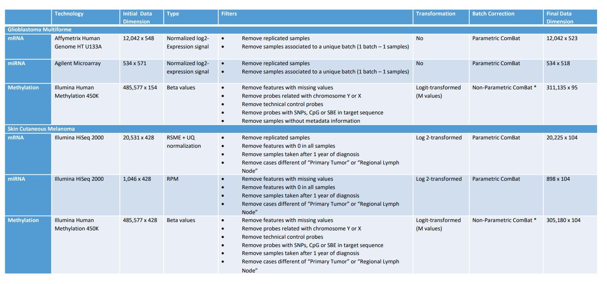

```{r setup, include=FALSE}
knitr::opts_chunk$set(echo = TRUE)
```

```{r chunck1, echo=FALSE}
# if (!requireNamespace("BiocManager", quietly = TRUE))
#     install.packages("BiocManager")
# BiocManager::install("STATegRa")
```

```{r chunck2,echo=FALSE}
# browseVignettes(package = "STATegRa")
```

# Note

This summary is about `STATegra` package. Based on [@Planell2020.11.20.391045]

# Keywords

* > omics: Multiple layers of cell regulation:

  + genome
  + transcriptome
  + epigenome
  + chromatin conformation
  + metabolome
  + etc

* > multi-omic analyses

* > data-integration
* > non-parametric combination
* > GeneSetCluster
* > (now)next-generation sequencing,
* > component analysis

# Abstract summary

There are several technologies for profiling samples using different omics platfroms. Large-scale multiomics data can decifpher different regulatory layers. 

The problem is that there are several analysis that appears to start from scratch. So there is a need to integrate such data and implement pipelines on different cases. The aim of this package is to be as generic as possible for multiomics analysis such as:

* ML-CA
* NPC data combination
* Multi-Omins exploratory analysis

In this paper, in order to evaluate STATeg**R**a they use two data sets from The Cancer Genome Atlas.

* Gliobastoma (GBM)
* Sking Cutaneous Melanoma (SKCM)

# Introduction Summary

Computational and experimental methods allows the profiling on multiple cell layers, globally known as "omics"

The development of such technologies give and understanding thata single-omic does not provide enough info to understand biological mechanism. 

Example: multi-omics data-sets are applied in cancer. But recent single-cell multi-omics has became a reallity (See section single cell-multi-omics)

From the necessity of multi-omics profiling came the need of multi-omics analysis tools. Integrate approaches are expected to generate insights into the biological systems under study (SuS)

Each of the tools is valuable, combining them into a unifed framework is a **key**. Equally important is the fact that each framework must beas generic as possible. Here is when it comes STATeg**R**a Biococonductor package.

# Materials and Methods sumamry

In the paper, as described above, they analyze two data-sets GBM and SKCM from TCGA. 

* **GBM**

Three data types were downloaded (microarray experiments):

* > array-based expression(mRNA) (523 samples)
* > array-based expression (miRNA) (518 samples)
* > array-based DNA Methylation (DNAm) (95 samples)

* **SKCM**

Three data types were downloaded

* > RNA-seq-based expression (mRNA) (NGS)
* > miRNA-seq-based expression (miRNA) (NGS)
* > array-based DNA Methylation (DNAm) (Microarray)

From 425 individuals,they decided to include only those cases for which specimens were obtained within a 1-year window from diagnosis ($n = 104$).

## Preprocessing Steps



### Filters:

From the two data sets, the original matrix signals, they applied several types of filters including:

* Removal of replicate samples
* Removal of samples associated with unique batches.
* Removal of missing vaues from features.
* Removal of techinal control probes
* In general for specific data type and experiment; removal if specific probes and samples
* Other specific filters.

### Data transformation.

#### GBM:

* Logit transformation for DNAm  data from $\beta-values$ to $M-values$ 
Beta-value method has severe heteroscedasticity for highly methylated or unmethylated CpG sites. For this reason the data is transformed to M values via logit transformation [@du2010comparison]

$$Mi=log2(\frac{\beta_i}{1-\beta_i})$$ 

#### SKCM

* (mRNA) RSME+Upper-Quantile normalization to $log2$ transformation
* From Reads per million mapped reads To $log2$
* Beta values to M values.

### Batch Correction

ComBat is an R function, that adjusts for batch effects. This function is applied across all data-sets. A non parametric ComBat is used for DNAm data sets. 

## Processing data-sets.

### Omics Component Analysis (From `browseVignettes` of `STATegRa` package. 

To perform joint exploration the data-types must 

1. Each feature must be scaled
2. Only samples that are common to the data types can be analyzed

Each feature was mean-centered and then normalized to the unit sum of squares (Frobenius normalization).
$$x_{norm}=\frac{x-E[x]}{|x-E[X]|}$$


Once the data-sets are ready, two main omicsPCA steps  were applied: model selection and subspace recovery.
Model Selection: which means the exact number of common (shared) components and the number of distinctive components per data-type  selection, we aimed to identify the correct model. We investigated

* **JIVE ** (Joint and individual variation explained (JIVE) for integrated analysis of multiple data types)

Research in several fields now requires the analysis of datasets in which multiple high-dimensional types of data are available for a common set of objects. In particular, The Cancer Genome Atlas (TCGA) includes data from several diverse genomic technologies on the same cancerous tumor samples. In this paper we introduce Joint and Individual Variation Explained (JIVE), a general decomposition of variation for the integrated analysis of such datasets. The decomposition consists of three terms: a low-rank approximation capturing joint variation across data types, low-rank approximations for structured variation individual to each data type, and residual noise. JIVE quantifies the amount of joint variation between data types, reduces the dimensionality of the data, and provides new directions for the visual exploration of joint and individual structure. The proposed method represents an extension of Principal Component Analysis and has clear advantages over popular two-block methods such as Canonical Correlation Analysis and Partial Least Squares. A JIVE analysis of gene expression and miRNA data on Glioblastoma Multiforme tumor samples reveals gene-miRNA associations and provides better characterization of tumor types.

* **PCA-GCA**

The PCA-GCA method (for details, see, Smilde et al., 2017) works in two steps. The first step concerns identifying the number of components for each data block. In this step, PCA is performed separately on each block, and the appropriate number of components for each block is identified (via, for example, a scree plot). However, deciding R for all data blocks by means of the PCA-GCA method requires a second step (discussed below); that is, R is obtained once the component structure is identified.

To identify the component structure, generalized canonical correlation analysis (GCA) is performed on the component scores of every two data blocks to identify the number of common components. A common component is identified if the correlation is above a threshold.

* **pESCA **

Separating common (global and local) and distinct variation in multiple mixed types data sets

Multiple sets of measurements on the same objects obtained from different platforms may reflect partially complementary information of the studied system. The integrative analysis of such data sets not only provides us with the opportunity of a deeper understanding of the studied system but also introduces some new statistical challenges. First, the separation of information that is common across all or some of the data sets and the information that is specific to each data set is problematic. Furthermore, these data sets are often a mix of quantitative and discrete (binary or categorical) data types, while commonly used data fusion methods require all data sets to be quantitative. In this paper, we propose an exponential family simultaneous component analysis (ESCA) model to tackle the potential mixed data types problem of multiple data sets. In addition, a structured sparse pattern of the loading matrix is induced through a nearly unbiased group concave penalty to disentangle the global, local common, and distinct information of the multiple data sets. A Majorization‐Minimization–based algorithm is derived to fit the proposed model. Analytic solutions are derived for updating all the parameters of the model in each iteration, and the algorithm will decrease the objective function in each iteration monotonically. For model selection, a missing value–based cross validation procedure is implemented. The advantages of the proposed method in comparison with other approaches are assessed using comprehensive simulations as well as the analysis of real data from a chronic lymphocytic leukaemia (CLL) study.


Each method provides the user with a decomposition of the variability of the composite data into common and distinctive variability. All of them are based on singular value decomposition (SVD) 


Finally, the association between metadata and the shared/individual components obtained was assessed using:
* Kruskal-Wallis test: Categorical (non parametric)
* Spearman’s correlation: Numerical (non parametric)
* Cox regression model: Time to event


*NOTE* ComBat allows users to adjust for batch effects in datasets where the batch covariate is known,
using methodology described in [@10.1093/biostatistics/kxj037]
[@10.1093/bioinformatics/bts034]


# Concepts I did not know

* Batch effect.

A batch effect occurs when non-biological factors in an experiment cause changes in the data produced by the experiment [@leek2010tackling] 


# Single cell multi-omics

[@macaulay2017single;@COLOMETATCHE201854;@chen2019high;@welch2019single]


# References


